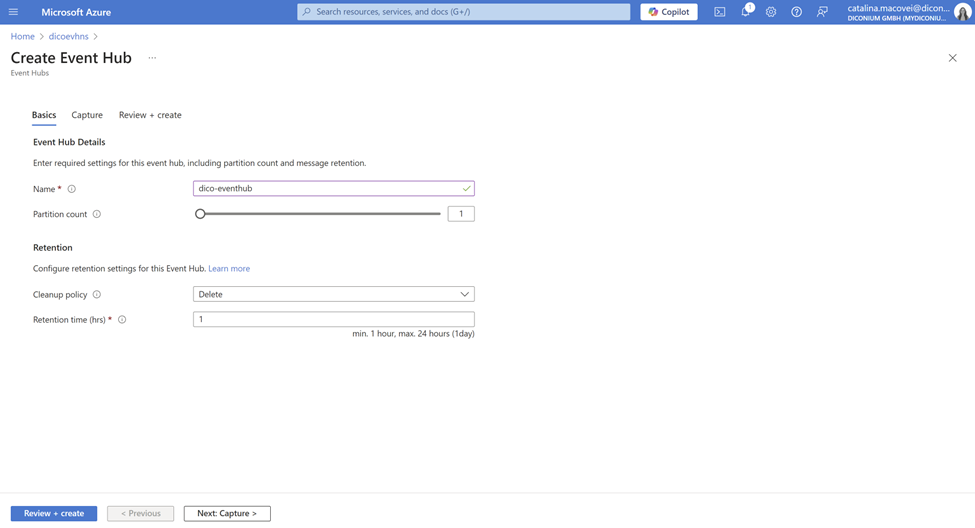
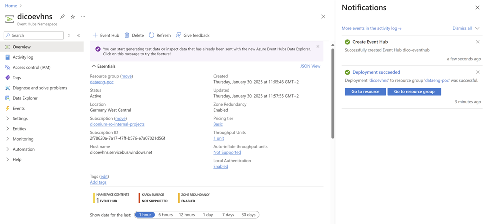
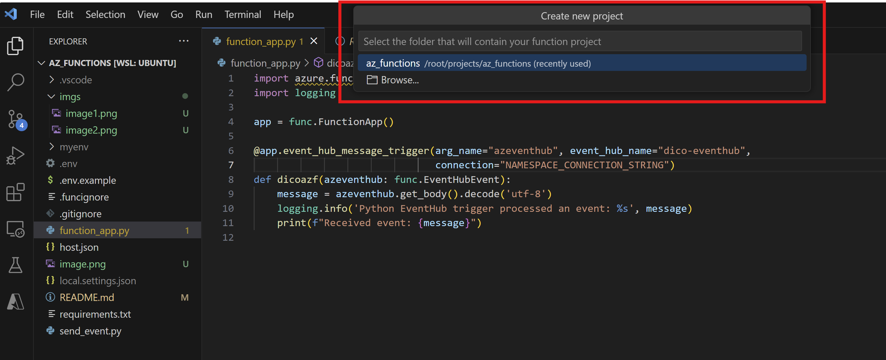
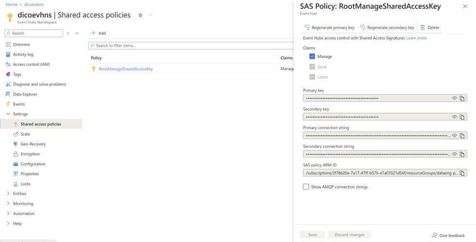
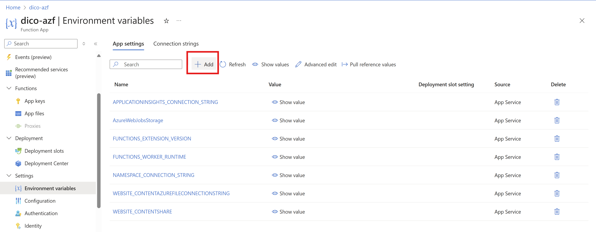
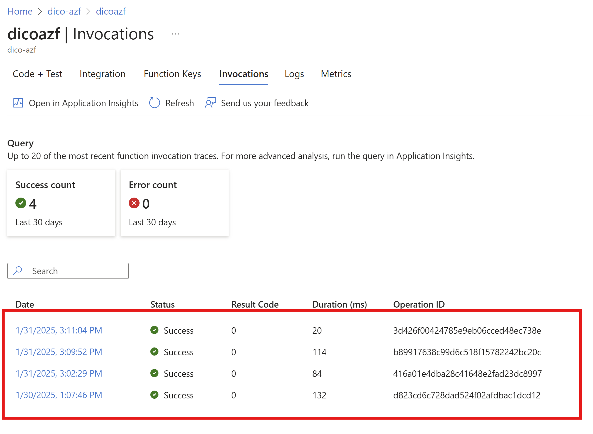
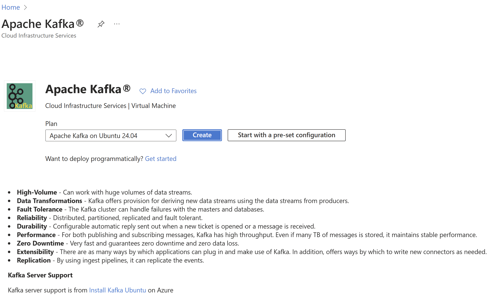
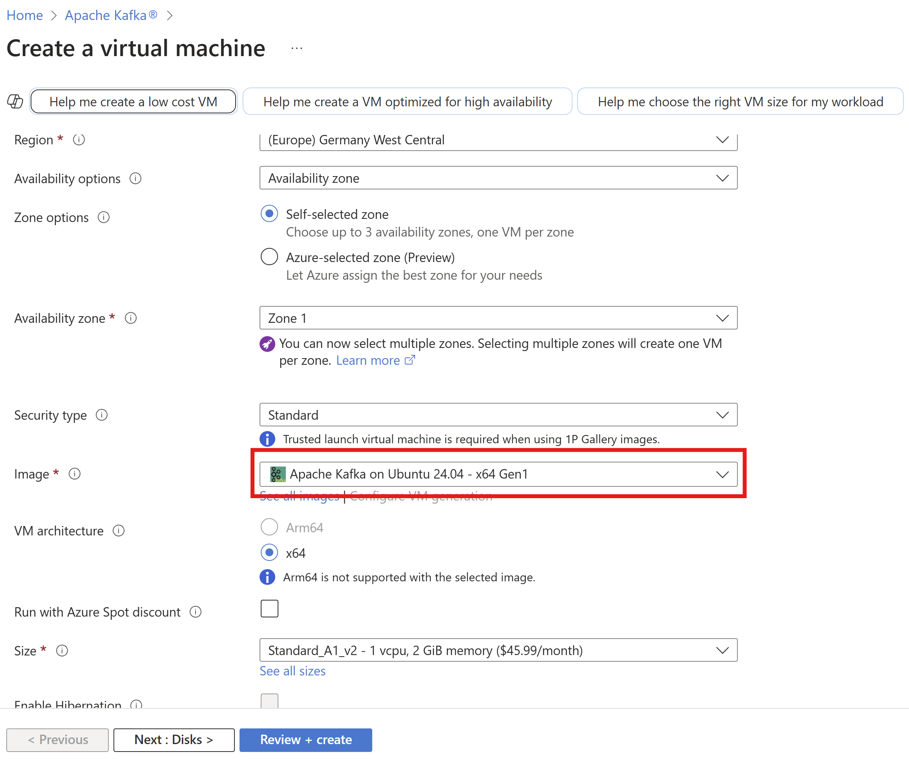

# Azure EventHub forwarder
This is a python-based app that sends messages to Azure Event Hub and forwards them to a Kafka server using an Azure Function.

## Demo

### 1. Evironment setup:
 - Install VSCode if you don't have it already  
- Setup ubuntu WSL following [this link](https://learn.microsoft.com/en-us/windows/wsl/tutorials/wsl-vscode)  
- Install python extension  
- Install Azure Functions extension
- Create a python venv by these steps:
- Navigate to the directory where you want to create your venv:
  ```python -m venv myenv```
- Activate it:
  ```source myenv/bin/activate```
- Install python packages within same venv:
    ```pip install azure-eventhub```
    ```pip install azure-identity```
    ```pip install aiohttp```

### 2. Create an Event Hub from Azure portal
- Create the Namespace
    - Select the subscription in which you want to create the namespace.
    - Select the resource group you created in the previous step.
    - Enter a name for the namespace. The system immediately checks to see if the name is available.
    - Select a location for the namespace. I chose Germany West.
    - Choose Basic for the pricing tier. 
    - Leave the throughput units settings as it is. 
    - Select ```Review + Create``` at the bottom of the page.
    - For a much detailed demo, you can use [Microsoft Documentation](https://learn.microsoft.com/en-us/azure/event-hubs/event-hubs-create)

- Create the main EventHub:
    - On the Overview page of the deployed Namespace, select ```+ Event hub``` on the command bar.
    - Type a name for your event hub, rest of settings leave as default, then select ```Review + create```.
      

- The end of this step should look like this:
  

### 3. Create the function app
- Navigate to VSCode and press F1 to browse for Azure actions in Command Palette, choose ```Azure Functions: Create New Project```. 
- Choose the set up project folder, mine is ```az_functions```
  
- Next, you will have many prompts regarding:
    - Language: python 
    - Function app version model: V2
    - Template: EventHub trigger.
      This will allow the function to be triggered when a message is received from an Event Hub.
    - Select Function Name
    - Select Storage Account. You still can create a new one here, if you need.
    - Select python version.
    - In function generated app, you need to set the parameters.
      ```
      arg_name="azeventhub"
      event_hub_name="your-eventhub-name"
      connection="NAMESPACE_CONNECTION_STRING"
      ```
    - You can print some log info in order to test the function later.
    - You should deploy the function using  VSCode Command Palette. 
    - Next, you have to setup ```NAMESPACE_CONNECTION_STRING``` evironment variable in the newly created resource of your function app from Azure portal.
      - This string you will take from ```EventHub Namespace > Settings > Shared Access Policies```. From window open to the left, copy ```Primary Connection String```. It looks like this:
      
      - In your ```function resource > Settings > Evironment variables > Add``` create the new environment variable and paste the connection string you copied earlier.
      
      - Deploy the function again.

### 4. Create a python event sender
Next, we will create a python event sender script: ```send_event.py```. You can copy paste the code from my script but make sure o create a local ```.env``` in the root of the project following ```.env.example``` file structure.  
  - Setup these ```.env``` variables
    ```
    CONNECTION_STRING=
    EVENT_HUB_NAME=
    ```
  - Then, run the script in your terminal with activated venv:
    ```python send_event.py``` 

### 5. Check function invocation 
Check function invocation from Azure portal, by navigating to ```function resource > Invocations```:


## Author
Catalina Macovei


# Apache Kafka setup
In this section there is a short demo on how to setup a resource of Apache Kafka Server on on Ubuntu 24.04 in Azure.
You can find in Azure Marketplace this resource:


After selecting `create button` you will be redirected to a normal VM setup portal which implicitly has the image of Apache Kafka on Ubuntu preselected.


### Configurations:
Since this VM is for learning purpose and it doesn't involve a real scenario, I left as default the networking setup. Also Size setup is set to the lowest possible parameter in order to save on budget.
  1. Computer name: dico-vm-kafka
  2. Operating system: Linux (ubuntu 24.04)
  3. VM generation: V1
  4. VM architecture: x64
  5. Size: Standard A1 v2
  6. vCPUs: 1
  7. RAM: 2 GiB
  8. Public IP address: 20.52.20.54 (Network interface: default)
  9. Private IP address: 10.0.0.4
  10. Virtual network/subnet: dico-vm-kafka-vnet/default

## Start the Kafka Environment
I prefer working from my local terminal so I have to loggin via SSH on the cloud VM. 
Once you deployed the VM you will get a pop-up with download key. This key will help us loggin via ssh. 

1. Login
  ```ssh -i <path/your_key.pem> azureuser@<your_public_ip>```
2. Once logged in, change your current path to the Kafka installation directory:
  ```cd /opt/kafka/```
3. You can use ths tutorial to see how to start zookeeper and kafka server on localhost. 
  [tutorial link](https://cloudinfrastructureservices.co.uk/how-to-setup-apache-kafka-server-on-azure-aws-gcp/)
4. In order to send messages from our azure functions I will configure the VM to listen to a public IP, not localhost. Because this is not a real scenario, I do not set up usernames and passwords, just ```PLAINTEXT```.  

To do this, let's update ```server.properties```:
Run: `sudo nano config/server.properties`

Paste following properties in `Socket Server Settings` section:
```
listeners=PLAINTEXT://0.0.0.0:9092
advertised.listeners=PLAINTEXT://20.52.20.54:9092
```

This is how it looks in my properties:
```
############################# Socket Server Settings #############################

# The address the socket server listens on. If not configured, the host name will be equal to the value of
# java.net.InetAddress.getCanonicalHostName(), with PLAINTEXT listener name, and port 9092.
#   FORMAT:
#     listeners = listener_name://host_name:port
#   EXAMPLE:
#     listeners = PLAINTEXT://your.host.name:9092
listeners=PLAINTEXT://0.0.0.0:9092

# Listener name, hostname and port the broker will advertise to clients.
# If not set, it uses the value for "listeners".
advertised.listeners=PLAINTEXT://20.52.20.54:9092
```

Afterwards, restart the server and create a topic:
```
 bin/kafka-topics.sh --create --topic test-topic --bootstrap-server 20.52.20.54:9092 --partitions 1 --replication-factor 1
```

Now you can use the producer to send messages to `test-topic` and the consumer to read them

## Create an azure function 
Follow the previous section steps to create an azure function. The configs remain the same but function app this time is an `http trigger`.
It will be tested locally first using this `local.settings.json`
```
{
  "IsEncrypted": false,
  "Values": {
    "AzureWebJobsStorage": "UseDevelopmentStorage=true",
    "FUNCTIONS_WORKER_RUNTIME": "python",
    "KafkaBroker": "20.52.20.54:9092"
  }
}
```
Here in the Kafka broker field is the IP and port we configured earlier our server to listen to. So make sure to replace it with yours.

The function app code is basic, it just sends a `message` you set up in query field. 
```
import azure.functions as func
import logging
from kafka import KafkaProducer

app = func.FunctionApp()

@app.function_name(name="KafkaHttpTrigger")
@app.route(route="KafkaHttpTrigger", auth_level=func.AuthLevel.FUNCTION)
def main(req: func.HttpRequest) -> func.HttpResponse:
    """Receives an HTTP request and sends the 'message' parameter to Apache Kafka."""

    message = req.params.get('message')

    if not message:
        return func.HttpResponse("Please provide a message in the query string", status_code=400)

    # Kafka Producer
    try:
        producer = KafkaProducer(
            bootstrap_servers='20.52.20.54:9092',  # vm public ip
            value_serializer=lambda v: str(v).encode('utf-8')  
        )

        # Send message
        producer.send('test-topic', value=message)
        producer.flush()
        logging.info(f"Message sent to Kafka topic: {message}")

        return func.HttpResponse(f"Message '{message}' sent to Kafka!", status_code=200)

    except Exception as e:
        logging.error(f"Failed to send message: {str(e)}")
        return func.HttpResponse(f"Error: {str(e)}", status_code=500)
```

Before running this function, install kafka  in your venv:
```
 pip install kafka-python
```

Run the function app with `func start`:
It will display some logs
 

Then type this url in your browser:
```
http://localhost:7071/api/KafkaHttpTrigger?message=test
```
It looks like this:


Now the message `test` will be sent to kafka and you can read it with the implicit consumer by using this command:
```
sudo bin/kafka-console-consumer.sh --topic test-topic --from-beginning --bootstrap-server 20.52.20.54:9092
```


